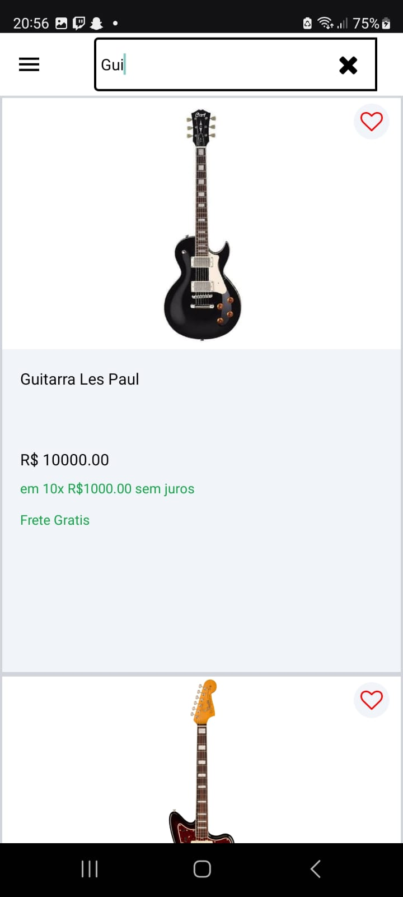

# GuitarStore - Aplicativo para venda de guitarras

## Tecnologias

_React Navigation_,
_Tailwind CSS_,
_Redux_,
_Async Storage_,
_Firebase_,
_Reducers_,
_Axios_,
_RestAPI_,
_Image-Picker_    

## Visão Geral do App    

| Tela                  | Foto                                              |
| --------------------- | ------------------------------------------------- |
| Preloading            |         |
| Login                 |                |
| Redefinir Senha App   |  |
| Redefinir Senha Gmail |  |
| Cadastro              |          |
| Home                  |                  |
| Filtro                |              |
| Produto               |            |
| Pesquisa              |          |
| Carrinho              |          |
| Favoritos             |        |
| Minha conta           |        |
| Minha conta           |        |
| Menu                  |                  |
| Adicionar Produtos    |      |
| Adicionar Produtos    |      |
